## [Appendices] Interests and Exposure Revisited: Explaining Gender Attitudes in the U.S. 1973-2018

### Table of Contents 

0. [Notes, Software, and Dependencies](#0-notes-software-and-dependencies)

1. [Regression Tables](#1-regression-tables)  
	a. [Multivariate Regression Tables](#a-multivariate-regression-tables---interactive-tables-made-available-here)  
		&nbsp;&nbsp;&nbsp;&nbsp;&nbsp;i. [Abortion Attitudes Multivariate Regression](#i-abortion-attitudes-multivariate-regression)  
		&nbsp;&nbsp;&nbsp;&nbsp;&nbsp;ii. [Sexual Behavior Attitudes Multivariate Regression](#ii-sexual-behavior-attitudes-multivariate-regression)  
		&nbsp;&nbsp;&nbsp;&nbsp;&nbsp;iii. [Gender Roles Attitudes Multivariate Regression](#iii-gender-roles-attitudes-multivariate-regression)    
		&nbsp;&nbsp;&nbsp;&nbsp;&nbsp;iv. [Family Responsibilities Attitudes Multivariate Regression](#iv-family-responsibilities-attitudes-multivariate-regression)    
	b. [Bivariate Regression Tables](#b-bivariate-regression-tables---interactive-tables-made-available-here)  
		&nbsp;&nbsp;&nbsp;&nbsp;&nbsp;i. [Abortion Attitudes Bivariate Regression](#i-abortion-attitudes-bivariate-regression)  
		&nbsp;&nbsp;&nbsp;&nbsp;&nbsp;ii. [Sexual Behavior Attitudes Bivariate Regression](#ii-sexual-behavior-attitudes-bivariate-regression)  
		&nbsp;&nbsp;&nbsp;&nbsp;&nbsp;iii. [Gender Roles Attitudes Bivariate Regression](#iii-gender-roles-attitudes-bivariate-regression)  
		&nbsp;&nbsp;&nbsp;&nbsp;&nbsp;iv. [Family Responsibilities Attitudes Bivariate Regression](#iv-family-responsibilities-attitudes-bivariate-regression)  


2. [Gender Attitudes Over Time by Political Preference](#2-gender-attitudes-over-time-by-political-preference)  
	a. [Mean Abortion Attitudes by Political Preference](#a-mean-abortion-attitudes-by-political-preference)  
	b. [Standard Deviation of Abortion Attitudes by Political Preference](#b-standard-deviation-of-abortion-attitudes-by-political-preference)  
	c. [Mean Sexual Behavior Attitudes by Political Preference](#c-mean-sexual-behavior-attitudes-by-political-preference)  
	d. [Standard Deviation of Sexual Behavior by Political Preference](#d-standard-deviation-of-sexual-behavior-attitudes-by-political-preference)  
	e. [Mean Gender Role Attitudes by Political Preference](#e-mean-gender-role-attitudes-by-political-preference)  
	f. [Standard Deviation of Gender Role Attitudes by Political Preference](#f-standard-deviation-of-gender-role-attitudes-by-political-preference)  
	g. [Mean Family Responsibilities Attitudes by Political Preference](#g-mean-family-responsibilities-attitudes-by-political-preference)  
	h. [Standard Deviation of Family Responsibilities Attitudes by Political Preference](#h-standard-deviation-of-family-responsibilities-attitudes-by-political-preference)   
	
3. [Gender Attitudes Over Time by Race](#3-gender-attitudes-over-time-by-race)  
	a. [Mean Abortion Attitudes by Race](#a-mean-abortion-attitudes-by-race)  
	b. [Standard Deviation of Abortion Attitudes by Race](#b-standard-deviation-of-abortion-attitudes-by-race)  
	c. [Mean Sexual Behavior Attitudes by Race](#c-mean-sexual-behavior-attitudes-by-race)  
	d. [Standard Deviation of Sexual Behavior Attitudes by Race](#d-standard-deviation-of-sexual-behavior-attitudes-by-race)  
	e. [Mean Gender Role Attitudes by Race](#e-mean-gender-role-attitudes-by-race)  
	f. [Standard Deviation of Gender Role Attitudes by Race](#f-standard-deviation-of-gender-role-attitudes-by-race)  
	g. [Mean Family Responsibilities Attitudes by Race](#g-mean-family-responsibilities-attitudes-by-race)  
	h. [Standard Deviation of Family Responsibilities Attitudes by Race](#h-standard-deviation-of-family-responsibilities-attitudes-by-race)   

4. [Dependent Variable Question Phrasing](#4-dependent-variable-question-phrasing)  
	a. [Abortion Attitudes Question Phrasing](#a-abortion-attitudes-question-phrasing)  
	b. [Sexual Behavior Attitudes Question Phrasing](#b-sexual-behavior-attitudes-question-phrasing)  
	c. [Gender Role Attitudes Question Phrasing](#c-gender-roles-attitudes-question-phrasing)  
	d. [Family Responsibilities Attitudes Question Phrasing](#d-family-responsibilities-attitudes-question-phrasing)  

5. [Independent Variable Coding](#5-independent-variable-coding)

6. [Code Documentation](#6-code-documentation)  
	a. [Process Flow Diagram](#a-process-flow-diagram)  
	b. [Code Contents](#b-code-contents)  

7. [Extended Bibliography](#7-extended-bibliography)

8. [Descriptives by Attitude, Gender, and Period](#8-descriptives-by-attitude-gender-and-period)
<hr>


#### 0. Notes, Software, and Dependencies

1. All computational analysis was done using [Stata](https://www.stata.com/).    
2. All data visualization was done using [Microsoft Excel](https://www.microsoft.com/en-us/microsoft-365/excel).  
3. Exporting data to Excel from Stata was done using the Stata module [outreg2](https://ideas.repec.org/c/boc/bocode/s456416.html#:~:text=The%20functionality%20of%20outreg2%20is,outreg%2C%20by%20John%20Luke%20Gallup.), made by [Roy Wada](https://scholar.google.com/citations?user=I9hqGW0AAAAJ&hl=en).  
4. README.md file created using [Markdown Preview](https://github.com/facelessuser/MarkdownPreview), created and maintained by [Isaac Muse](https://github.com/facelessuser).
5. Multivariate regression estimated-R<sup>2</sup> values relying on multiple imputation were calculated using the Stata module [mibeta](https://www.stata.com/statalist/archive/2010-09/msg00630.html), made by [Yulia V. Marchenko](https://www.stata-journal.com/sjmatches.html?authorname=Yulia%20V.%20Marchenko).  
6. All [Gender Attitude Graphs](#2-gender-attitudes-over-time-by-political-preference) use variables that have been rescaled to range from 0 to 10.  
7. All multiple imputation calculations were administered using random-number seed 1234:
```
rseed(1234)
```   
8. All multiple imputation calculations of each dependent variable use 20 imputations:
```
add(20)
```   
9. Trends were tested by t-test comparisons, a simple regression analysis, or in the case of standard deviations:  

      F = s<sub>2</sub><sup>1</sup>/ s<sub>2</sub><sup>2</sup> with N<sub>1</sub>, N<sub>2</sub> *df*.  

10. Differences in coefficients across periods or groups were tested using:   

      

<hr>

#### 1. Regression Tables  
**Please note:**  
- Standard errors are in parantheses following the coefficient.  
- p-values are calculated using a two-tailed test.  
- p-value indicators of all regression tables are as follows:  
```
  * p < 0.05
 ** p < 0.01
*** p < 0.001
```
- Regression table heads *Pre-Stall*, *Stall*, and *Post-Stall* inclusively refer to the following time periods:
```
 Pre-Stall: 1973-1993
     Stall: 1993-2004
Post-Stall: 2004-2018
```  

##### a. Multivariate Regression Tables - Interactive tables made available [here](./demonstratives/Multivariate_Regression_Tables.xlsx).  

###### i. Abortion Attitudes Multivariate Regression  


###### ii. Sexual Behavior Attitudes Multivariate Regression  
  


###### iii. Gender Roles Attitudes Multivariate Regression  
  


###### iv. Family Responsibilities Attitudes Multivariate Regression  
  


##### b. Bivariate Regression Tables - Interactive tables made available [here](./demonstratives/Bivariate_Regression_Tables.xlsx).  


###### i. Abortion Attitudes Bivariate Regression  
  


###### ii. Sexual Behavior Attitudes Bivariate Regression  
  


###### iii. Gender Roles Attitudes Bivariate Regression  
  


###### iv. Family Responsibilities Attitudes Bivariate Regression  
  


<hr>

#### 2. Gender Attitudes Over Time by Political Preference  
Interactive data and charts made available [here](./demonstratives/Gender_Attitudes_by_Political_Preference.xlsx).


##### a. Mean Abortion Attitudes by Political Preference  
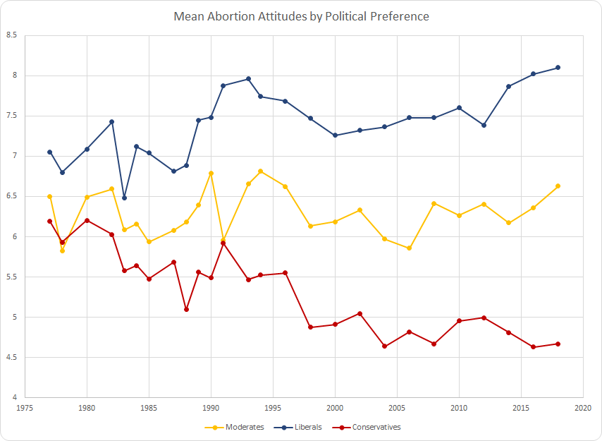  


##### b. Standard Deviation of Abortion Attitudes by Political Preference  
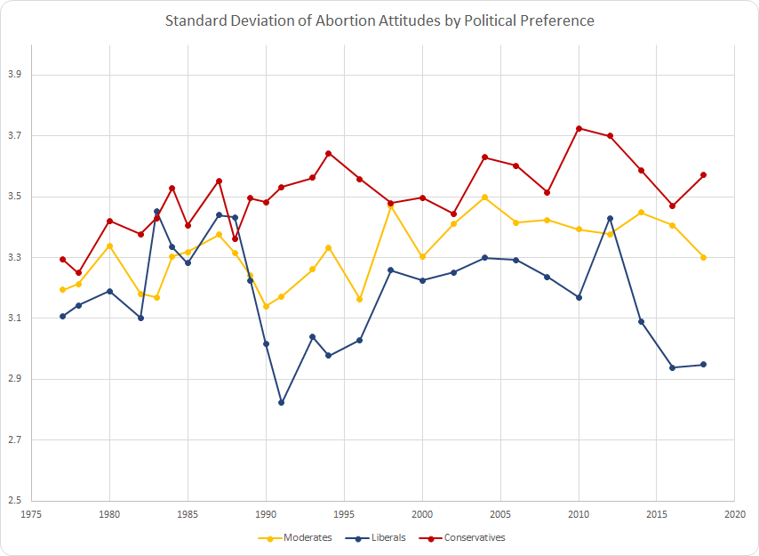  


##### c. Mean Sexual Behavior Attitudes by Political Preference  
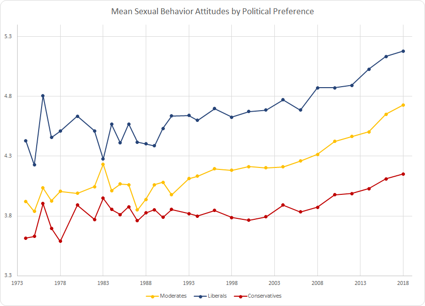  


##### d. Standard Deviation of Sexual Behavior Attitudes by Political Preference  
  


##### e. Mean Gender Role Attitudes by Political Preference  
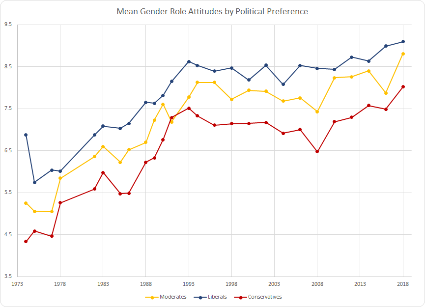  


##### f. Standard Deviation of Gender Role Attitudes by Political Preference  
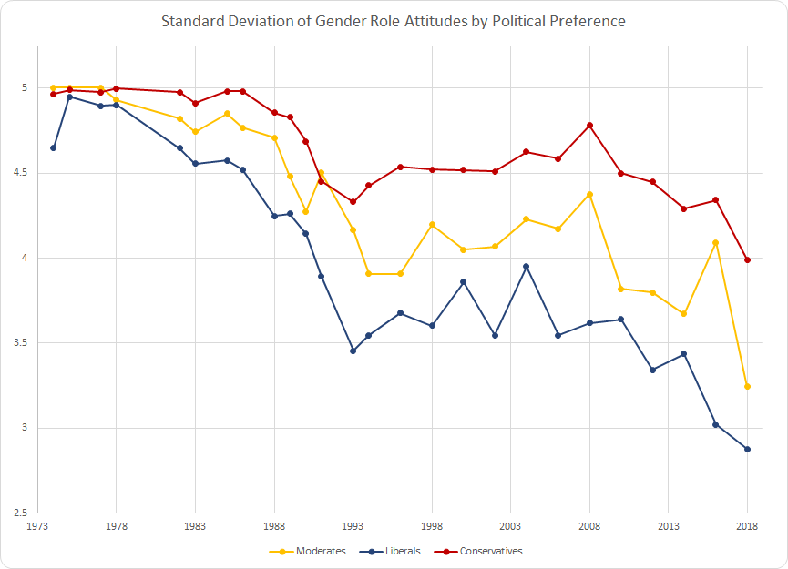    


##### g. Mean Family Responsibilities Attitudes by Political Preference  
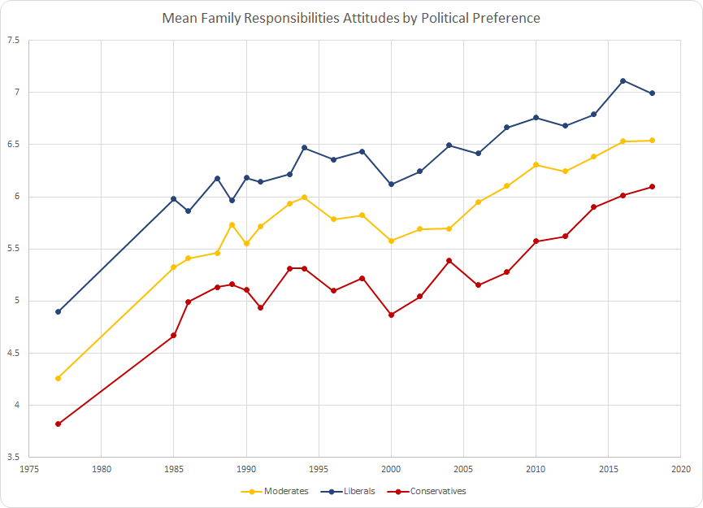  


##### h. Standard Deviation of Family Responsibilities Attitudes by Political Preference  
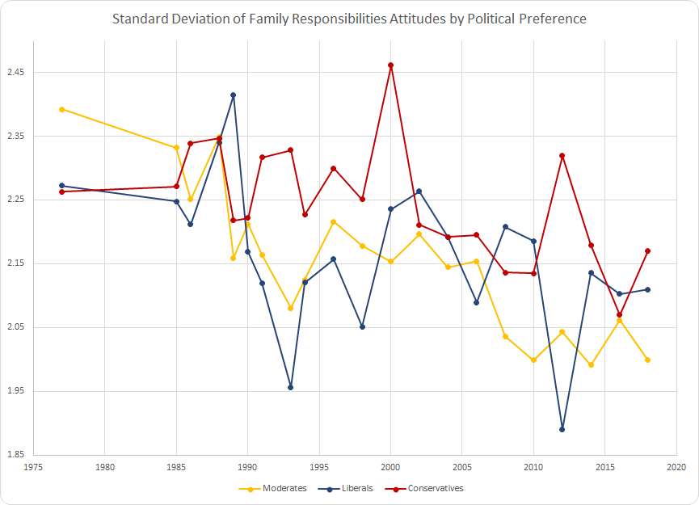  


<hr>

#### 3. Gender Attitudes Over Time by Race  
Interactive data and charts made available [here](./demonstratives/Gender_Attitudes_by_Race.xlsx).  


##### a. Mean Abortion Attitudes by Race  
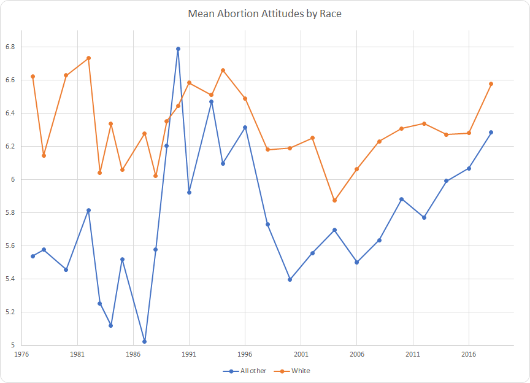  


##### b. Standard Deviation of Abortion Attitudes by Race  
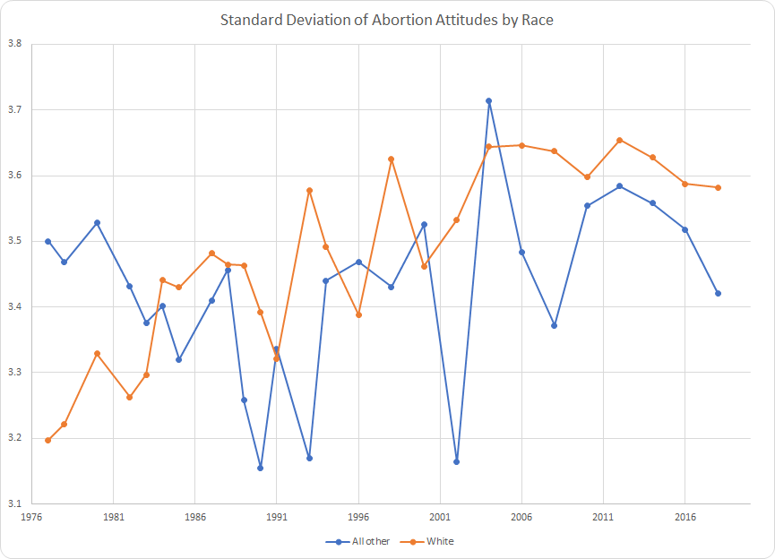  


##### c. Mean Sexual Behavior Attitudes by Race  
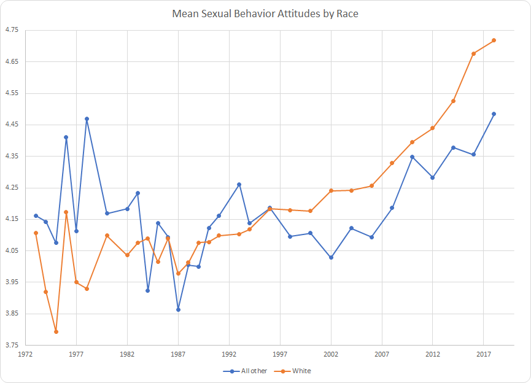  


##### d. Standard Deviation of Sexual Behavior Attitudes by Race  
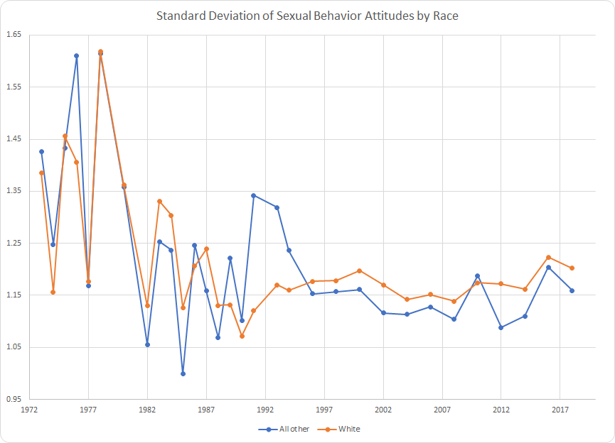  


##### e. Mean Gender Role Attitudes by Race  
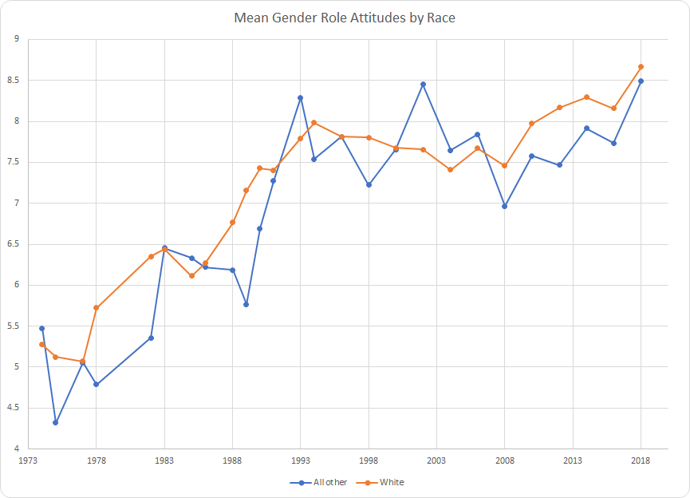  


##### f. Standard Deviation of Gender Role Attitudes by Race  
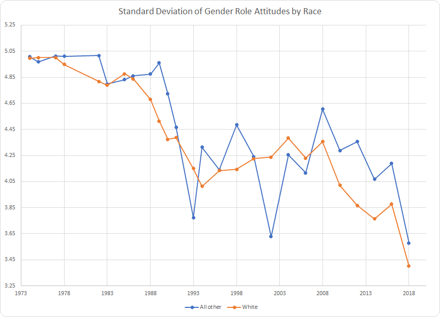    


##### g. Mean Family Responsibilities Attitudes by Race  
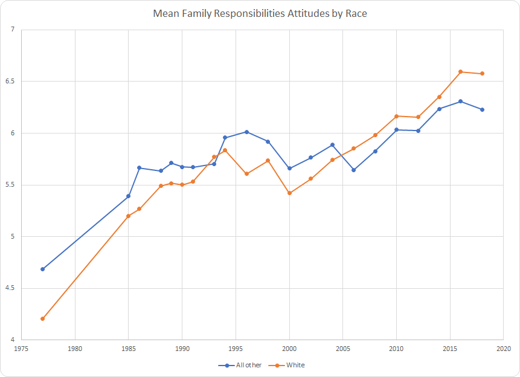  


##### h. Standard Deviation of Family Responsibilities Attitudes by Race  
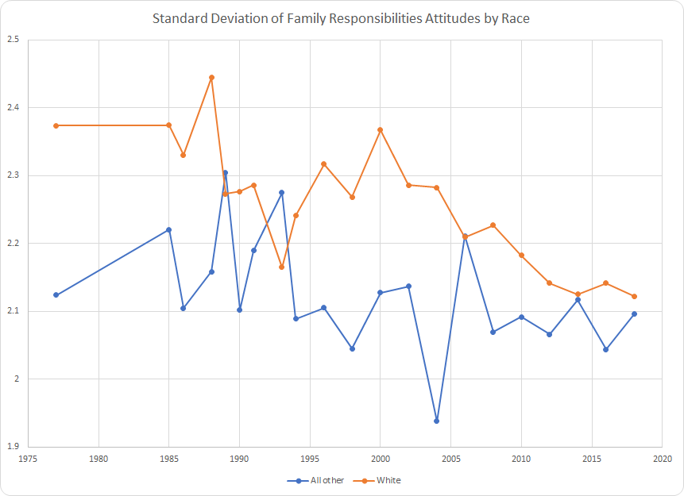  

<hr>

#### 4. Dependent Variable Question Phrasing

##### a. Abortion Attitudes Question Phrasing  
1. Please tell me whether or not you think it should be possible for a pregnant woman to obtain a legal abortion if the family has a very low income and cannot afford any more children? (**GSS Variable:** [abpoor](https://gssdataexplorer.norc.org/variables/604/vshow))  

2. Please tell me whether or not you think it should be possible for a pregnant woman to obtain a legal abortion if the woman's own health is seriously endangered by the pregnancy? (**GSS Variable:** [abhlth](https://gssdataexplorer.norc.org/variables/603/vshow))  

3. Please tell me whether or not you think it should be possible for a pregnant woman to obtain a legal abortion if she is married and does not want any more children? (**GSS Variable:** [abnomore](https://gssdataexplorer.norc.org/variables/602/vshow))  

4. Please tell me whether or not you think it should be possible for a pregnant woman to obtain a legal abortion if there is a strong chance of serious defect in the baby? (**GSS Variable:** [abdefect](https://gssdataexplorer.norc.org/variables/601/vshow))  

5. Please tell me whether or not you think it should be possible for a pregnant woman to obtain a legal abortion if she became pregnant as a result of rape? (**GSS Variable:** [abrape](https://gssdataexplorer.norc.org/variables/605/vshow))  

6. Please tell me whether or not you think it should be possible for a pregnant woman to obtain a legal abortion if she is not married and does not want to marry the man? (**GSS Variable:** [absingle](https://gssdataexplorer.norc.org/variables/606/vshow))  

7. Please tell me whether or not you think it should be possible for a pregnant woman to obtain a legal abortion if the woman wants it for any reason? (**GSS Variable:** [abany](https://gssdataexplorer.norc.org/variables/607/vshow))  

##### b. Sexual Behavior Attitudes Question Phrasing

1. Would you be for or against sex education in the public schools? (**GSS Variable:** [sexeduc](https://gssdataexplorer.norc.org/variables/626/vshow))  

2. There's been a lot of discussion about the way morals and attitudes about sex are changing in this country. If a man and woman have sex relations before marriage, do you think it is always wrong, almost always wrong, wrong only sometimes, or not wrong at all? (**GSS Variable:** [premarsx](https://gssdataexplorer.norc.org/variables/631/vshow))  

3. Questions associated with this variable: There's been a lot of discussion about the way morals and attitudes about sex are changing in this country. If a man and woman have sex relations before marriage, do you think it is always wrong, almost always wrong, wrong only sometimes, or not wrong at all? A. What if they are in their early teens, say 14 to 16 years old? In that case, do you think sex relations before marriage are always wrong, almost always wrong, wrong only sometimes, or not wrong at all? (**GSS Variable:** [teensex](https://gssdataexplorer.norc.org/variables/632/vshow))  

4. What about sexual relations between two adults of the same sex--do you think it is always wrong, almost always wrong, wrong only sometimes, or not wrong at all? (**GSS Variable:** [homosex](https://gssdataexplorer.norc.org/variables/634/vshow))   

5. What is your opinion about a married person having sexual relations with someone other than the marriage partner--is it always wrong, almost always wrong, wrong only sometimes, or not wrong at all? (**GSS Variable:** [xmarsex](https://gssdataexplorer.norc.org/variables/633/vshow))  

##### c. Gender Roles Attitudes Question Phrasing  
1. Tell me if you agree or disagree with this statement: Most men are better suited emotionally for politics than are most women. (**GSS Variable:** [fepol](https://gssdataexplorer.norc.org/variables/591/vshow))  

##### d. Family Responsibilities Attitudes Question Phrasing  
Now I'm going to read several more statements. As I read each one, please tell me whether you strongly agree, agree, disagree, or strongly disagree with it. For example, here is the statement:  

1. A working mother can establish just as warm and secure a relationship with her children as a mother who does not work. (**GSS Variable:** [fechld](https://gssdataexplorer.norc.org/variables/703/vshow))  

2. A preschool child is likely to suffer if his or her mother works. (**GSS Variable:** [fepresch](https://gssdataexplorer.norc.org/variables/705/vshow))  

3. It is much better for everyone involved if the man is the achiever outside the home and the woman takes care of the home and family. (**GSS Variable:** [fefam](https://gssdataexplorer.norc.org/variables/706/vshow))  

<hr>

#### 5. Independent Variable Coding

1. Religions are coded into 5 categories: Catholic, Jewish, Baptist/Conservative Protestant Sects, None/Other, and Mainline Protestants (Comparison Category).  

2. Race, reflecting limitations of the GSS data, is coded into three groups: Black, White (Comparison Category), and All Other.

3. Following Eric Plutzer (1988), regions are coded into 3 categories: South, Midwest, and North/West (Comparison Category).

4. Marital status is divided into 4 categories: Married, Never Married, Widowed, and Divorced (Comparison Category).

5. Respondent's labor force status is made up of 3 categories: Currently in labor force, has been in labor force but is not currently, and never been in labor force (Comparison Category).

6. Respondent's spouse's labor force status is made of up of 3 categories: Spouse is currently in labor force, spouse has been in labor force but is not currently, and spouse has never been in labor force (Comparison Category).

7. Proportion of income is calculated by dividing respondent's individual income by respondent's family (household) income.

8. Mother's education and education use the number of years respondent's mother and the respondent completed in school, respectively.

9. Hours worked weekly uses the number of hours respondent worked last week, and if not available, the number of hours the respondent usually works in a given week.

10. Urban/rural locations are coded into 3 categories: All cities and suburbs of the largest Metropolitan Statistical Areas, Counties with towns that have a populatio of 10,000 or more, and all other.

11. Number of children uses the number of children respondent has had.

12. Age uses respondent's age.

13. Political views are coded using a 1 to 7 scale from Extremely Liberal to Extremely Conservative based on respondent's self-identification. 

<hr>

#### 6. Code Documentation  

##### a. Process flow diagram  
To aid in replicating the data shared in this study and repository, a process flow diagram beginning with GSS Data and ending with regression tables/attitude summarizations is provided below:   

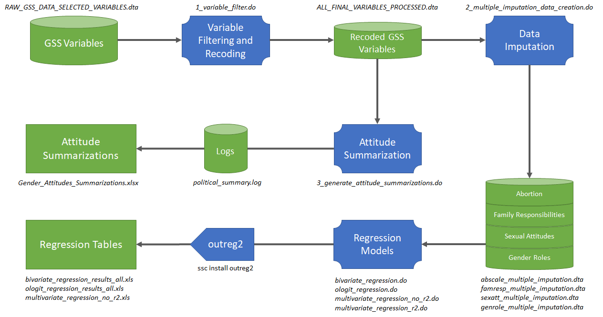  

##### b. Code Contents

1. Selected GSS variables for this study are found here: [RAW_GSS_SELECTED_VARIABLES.dta](./do/RAW_GSS_DATA_SELECTED_VARIABLES.dta)  

2. Code to filter the [selected GSS variables](./do/RAW_GSS_DATA_SELECTED_VARIABLES.dta) and generate attitude scales are found here: [1_variable_filter.do](./do/1_variable_filter.do)  

3. [The variable filter](./do/1_variable_filter.do) outputs filtered/processed variables here: [ALL_FINAL_VARIABLES_PROCESSED.dta](./do/ALL_FINAL_VARIABLES_PROCESSED.dta)  

4. To impute missing data in the [processed dataset](./do/ALL_FINAL_VARIABLES_PROCESSED.dta), execute the multiple imputation code, found here: [2_multiple_imputation_data_creation.do](./do/2_multiple_imputation_data_creation.do)  

5. [The imputation code](./do/2_multiple_imputation_data_creation.do) outputs an imputed dataset for each independent variable:
	- [abscale_multiple_imputation.dta](./do/mi_results_and_regressions/abscale_multiple_imputation.dta)  
	- [sexatt_multiple_imputation.dta](./do/mi_results_and_regressions/sexatt_multiple_imputation.dta)  
	- [genrole_multiple_imputation.dta](./do/mi_results_and_regressions/genrole_multiple_imputation.dta)  
	- [famresp_multiple_imputation.dta](./do/mi_results_and_regressions/famresp_multiple_imputation.dta)  

6. Regression models are computed using the [imputed datasets](./do/mi_results_and_regressions). The following regression computations available are:  
	- [Bivariate Regression](./do/mi_results_and_regressions/bivariate_regression.do)  
	- [Multivariate Regression](./do/mi_results_and_regressions/multivariate_regression_r2.do)  
	- [Ordinal Logistic Regression](./do/mi_results_and_regressions/ologit_regression.do)  

7. Summary data is generated using the [non-imputed dataset](./do/ALL_FINAL_VARIABLES_PROCESSED.dta), code found here: [3_generate_attitude_summarizations.do](./do/3_generate_attitude_summarizations.do)  
8. ```.do``` files output ```.log``` files in the the same directory in which the ```.do``` file is executed. 

<hr>

#### 7. Extended Bibliography  

To view the extended bibliography for this paper, please click [here](https://anon-subsoci.github.io/Anonymous-Gender-Attitudes-Appendix/.).  

#### 8. Descriptives by Attitude, Gender, and Period

**a. Descriptives for Abortion Attitudes, Men, Pre-Stall**

|                           | mean      | sd        | min       | max     | count |
| ------------------------- | --------- | --------- | --------- | ------- | ----- |
| Abortion Attitudes        | 6.435131  | 3.314265  | 0         | 10      | 6425  |
| Age                       | 43.41366  | 16.79794  | 18        | 89      | 6411  |
| White                     | 0.8838911 | 0.3203805 | 0         | 1       | 6425  |
| Political identification  | 4.112406  | 1.363037  | 1         | 7       | 6094  |
| Religious attendance      | 3.478663  | 2.616637  | 0         | 8       | 6374  |
| Catholic                  | 0.2501167 | 0.4331138 | 0         | 1       | 6425  |
| Baptist/Protestant Sect   | 0.3610895 | 0.4803538 | 0         | 1       | 6425  |
| Jewish                    | 0.0233463 | 0.1510126 | 0         | 1       | 6425  |
| No religion or other      | 0.1256031 | 0.3314273 | 0         | 1       | 6425  |
| South                     | 0.3313619 | 0.4707395 | 0         | 1       | 6425  |
| Midwest                   | 0.2854475 | 0.4516624 | 0         | 1       | 6425  |
| Urban                     | 3.042957  | 1.298777  | 2         | 6       | 6425  |
| Mother's Education        | 10.48895  | 3.655725  | 0         | 20      | 5473  |
| Education                 | 12.68258  | 3.394569  | 0         | 20      | 6411  |
| Married                   | 0.6306615 | 0.4826633 | 0         | 1       | 6425  |
| Never married             | 0.2202335 | 0.4144363 | 0         | 1       | 6425  |
| Widowed                   | 0.037821  | 0.190778  | 0         | 1       | 6425  |
| Number of children        | 1.788693  | 1.775739  | 0         | 8       | 6403  |
| In labor force            | 0.7990661 | 0.4007299 | 0         | 1       | 6425  |
| Previously in labor force | 0.1849027 | 0.3882488 | 0         | 1       | 6425  |
| Spouse works              | 0.3352529 | 0.4721155 | 0         | 1       | 6425  |
| Spouse used to work       | 0.5889494 | 0.4920627 | 0         | 1       | 6425  |
| Proportion of Income      | 0.7563986 | 0.2862036 | 0.0053195 | 2.16674 | 4851  |
| Hours worked Weekly       | 44.68231  | 14.14925  | 0         | 98      | 4794  |

**b. Descriptives for Abortion Attitudes, Men, Stall**
|                           | mean      | sd        | min       | max      | count |
| ------------------------- | --------- | --------- | --------- | -------- | ----- |
| Abortion Attitudes        | 6.376945  | 3.445337  | 0         | 10       | 4040  |
| Age                       | 44.40431  | 16.38776  | 18        | 89       | 4034  |
| White                     | 0.8373762 | 0.3690677 | 0         | 1        | 4040  |
| Political identification  | 4.180102  | 1.411762  | 1         | 7        | 3920  |
| Religious attendance      | 3.261515  | 2.627288  | 0         | 8        | 3973  |
| Catholic                  | 0.2507426 | 0.4334942 | 0         | 1        | 4040  |
| Baptist/Protestant Sect   | 0.3252475 | 0.4685252 | 0         | 1        | 4040  |
| Jewish                    | 0.0212871 | 0.1443577 | 0         | 1        | 4040  |
| No religion or other      | 0.209901  | 0.4072881 | 0         | 1        | 4040  |
| South                     | 0.3522277 | 0.4777236 | 0         | 1        | 4040  |
| Midwest                   | 0.2519802 | 0.4342037 | 0         | 1        | 4040  |
| Urban                     | 2.884158  | 1.125652  | 2         | 6        | 4040  |
| Mother's Education        | 11.60764  | 3.352553  | 0         | 20       | 3535  |
| Education                 | 13.50149  | 3.033183  | 0         | 20       | 4032  |
| Married                   | 0.5306931 | 0.4991188 | 0         | 1        | 4040  |
| Never married             | 0.2626238 | 0.4401142 | 0         | 1        | 4040  |
| Widowed                   | 0.0368812 | 0.1884934 | 0         | 1        | 4040  |
| Number of children        | 1.634897  | 1.655685  | 0         | 8        | 4029  |
| In labor force            | 0.7893564 | 0.4078162 | 0         | 1        | 4040  |
| Previously in labor force | 0.1928218 | 0.3945631 | 0         | 1        | 4040  |
| Spouse works              | 0.3383663 | 0.4732124 | 0         | 1        | 4040  |
| Spouse used to work       | 0.6242574 | 0.484374  | 0         | 1        | 4040  |
| Proportion of Income      | 0.755328  | 0.301592  | 0.0038217 | 1.707742 | 2933  |
| Hours worked Weekly       | 45.55121  | 14.10524  | 0         | 98       | 3017  |

**c. Descriptives for Abortion Attitudes, Men, Post-Stall**
|                           | mean      | sd        | min       | max      | count |
| ------------------------- | --------- | --------- | --------- | -------- | ----- |
| Abortion Attitudes        | 6.326747  | 3.509191  | 0         | 10       | 4714  |
| Age                       | 47.18738  | 16.91921  | 18        | 89       | 4707  |
| White                     | 0.7638948 | 0.4247326 | 0         | 1        | 4714  |
| Political identification  | 4.112082  | 1.477801  | 1         | 7        | 4577  |
| Religious attendance      | 3.049362  | 2.723029  | 0         | 8        | 4700  |
| Catholic                  | 0.2269835 | 0.4189262 | 0         | 1        | 4714  |
| Baptist/Protestant Sect   | 0.3186254 | 0.4659928 | 0         | 1        | 4714  |
| Jewish                    | 0.0169707 | 0.1291753 | 0         | 1        | 4714  |
| No religion or other      | 0.31014   | 0.4625998 | 0         | 1        | 4714  |
| South                     | 0.3691133 | 0.4826159 | 0         | 1        | 4714  |
| Midwest                   | 0.2367416 | 0.4251275 | 0         | 1        | 4714  |
| Urban                     | 2.999364  | 1.187941  | 2         | 6        | 4714  |
| Mother's Education        | 11.92499  | 3.697991  | 0         | 20       | 4186  |
| Education                 | 13.69907  | 3.092615  | 0         | 20       | 4712  |
| Married                   | 0.482605  | 0.4997503 | 0         | 1        | 4714  |
| Never married             | 0.295927  | 0.4565068 | 0         | 1        | 4714  |
| Widowed                   | 0.0383963 | 0.1921713 | 0         | 1        | 4714  |
| Number of children        | 1.699681  | 1.699755  | 0         | 8        | 4705  |
| In labor force            | 0.7365295 | 0.4405621 | 0         | 1        | 4714  |
| Previously in labor force | 0.2435299 | 0.4292577 | 0         | 1        | 4714  |
| Spouse works              | 0.2829868 | 0.4504979 | 0         | 1        | 4714  |
| Spouse used to work       | 0.6815868 | 0.4659102 | 0         | 1        | 4714  |
| Proportion of Income      | 0.746716  | 0.3727553 | 0.0019671 | 3.285203 | 3044  |
| Hours worked Weekly       | 45.09188  | 14.7352   | 1         | 98       | 3189  |

**d. Descriptives for Abortion Attitudes, Women, Pre-Stall**
|                           | mean      | sd        | min       | max      | count |
| ------------------------- | --------- | --------- | --------- | -------- | ----- |
| Abortion Attitudes        | 6.136864  | 3.431086  | 0         | 10       | 8367  |
| Age                       | 44.81672  | 17.86792  | 18        | 89       | 8326  |
| White                     | 0.850484  | 0.3566176 | 0         | 1        | 8367  |
| Political identification  | 4.056168  | 1.294756  | 1         | 7        | 7531  |
| Religious attendance      | 4.242421  | 2.659258  | 0         | 8        | 8312  |
| Catholic                  | 0.2531373 | 0.4348349 | 0         | 1        | 8367  |
| Baptist/Protestant Sect   | 0.3928529 | 0.4884138 | 0         | 1        | 8367  |
| Jewish                    | 0.0215131 | 0.1450958 | 0         | 1        | 8367  |
| No religion or other      | 0.0712322 | 0.2572277 | 0         | 1        | 8367  |
| South                     | 0.3297478 | 0.4701496 | 0         | 1        | 8367  |
| Midwest                   | 0.2775188 | 0.4478014 | 0         | 1        | 8367  |
| Urban                     | 3.047687  | 1.288893  | 2         | 6        | 8367  |
| Mother's Education        | 10.25495  | 3.637602  | 0         | 20       | 7115  |
| Education                 | 12.3051   | 2.900282  | 0         | 20       | 8348  |
| Married                   | 0.5324489 | 0.4989758 | 0         | 1        | 8367  |
| Never married             | 0.1575236 | 0.3643155 | 0         | 1        | 8367  |
| Widowed                   | 0.1456914 | 0.3528177 | 0         | 1        | 8367  |
| Number of children        | 2.055875  | 1.844213  | 0         | 8        | 8340  |
| In labor force            | 0.54703   | 0.497813  | 0         | 1        | 8367  |
| Previously in labor force | 0.3559221 | 0.4788204 | 0         | 1        | 8367  |
| Spouse works              | 0.4299032 | 0.4950916 | 0         | 1        | 8367  |
| Spouse used to work       | 0.567826  | 0.4954079 | 0         | 1        | 8367  |
| Proportion of Income      | 0.5485289 | 0.3512929 | 0.0044405 | 1.232859 | 4507  |
| Hours worked Weekly       | 37.0727   | 13.15592  | 1         | 98       | 4429  |

**e. Descriptives for Abortion Attitudes, Women, Stall**
|                           | mean      | sd        | min       | max      | count |
| ------------------------- | --------- | --------- | --------- | -------- | ----- |
| Abortion Attitudes        | 6.167569  | 3.568776  | 0         | 10       | 4989  |
| Age                       | 45.57045  | 17.07912  | 18        | 89       | 4975  |
| White                     | 0.792744  | 0.4053811 | 0         | 1        | 4989  |
| Political identification  | 4.040311  | 1.383003  | 1         | 7        | 4763  |
| Religious attendance      | 3.912202  | 2.736274  | 0         | 8        | 4909  |
| Catholic                  | 0.2341151 | 0.4234869 | 0         | 1        | 4989  |
| Baptist/Protestant Sect   | 0.3772299 | 0.4847418 | 0         | 1        | 4989  |
| Jewish                    | 0.0192423 | 0.1373894 | 0         | 1        | 4989  |
| No religion or other      | 0.152736  | 0.3597689 | 0         | 1        | 4989  |
| South                     | 0.3579876 | 0.4794565 | 0         | 1        | 4989  |
| Midwest                   | 0.2383243 | 0.4261012 | 0         | 1        | 4989  |
| Urban                     | 2.91822   | 1.153655  | 2         | 6        | 4989  |
| Mother's Education        | 11.37962  | 3.394886  | 0         | 20       | 4278  |
| Education                 | 13.24965  | 2.806706  | 0         | 20       | 4979  |
| Married                   | 0.4483865 | 0.4973788 | 0         | 1        | 4989  |
| Never married             | 0.2124674 | 0.4090948 | 0         | 1        | 4989  |
| Widowed                   | 0.1256765 | 0.3315176 | 0         | 1        | 4989  |
| Number of children        | 1.929906  | 1.669723  | 0         | 8        | 4979  |
| In labor force            | 0.6392063 | 0.4802789 | 0         | 1        | 4989  |
| Previously in labor force | 0.2976548 | 0.4572727 | 0         | 1        | 4989  |
| Spouse works              | 0.3583885 | 0.4795751 | 0         | 1        | 4989  |
| Spouse used to work       | 0.638204  | 0.4805683 | 0         | 1        | 4989  |
| Proportion of Income      | 0.6338673 | 0.3466415 | 0.0022796 | 1.707742 | 2959  |
| Hours worked Weekly       | 38.72629  | 13.78077  | 1         | 98       | 3058  |

**f. Descriptives for Abortion Attitudes, Women, Post-Stall**
|                           | mean      | sd        | min       | max      | count |
| ------------------------- | --------- | --------- | --------- | -------- | ----- |
| Abortion Attitudes        | 6.016628  | 3.668711  | 0         | 10       | 5722  |
| Age                       | 47.89598  | 17.47663  | 18        | 89       | 5701  |
| White                     | 0.7408249 | 0.4382202 | 0         | 1        | 5722  |
| Political identification  | 3.998555  | 1.451653  | 1         | 7        | 5537  |
| Religious attendance      | 3.700579  | 2.818918  | 0         | 8        | 5701  |
| Catholic                  | 0.2261447 | 0.4183705 | 0         | 1        | 5722  |
| Baptist/Protestant Sect   | 0.3752185 | 0.4842216 | 0         | 1        | 5722  |
| Jewish                    | 0.0164278 | 0.127125  | 0         | 1        | 5722  |
| No religion or other      | 0.2341839 | 0.4235246 | 0         | 1        | 5722  |
| South                     | 0.3787137 | 0.485109  | 0         | 1        | 5722  |
| Midwest                   | 0.2347081 | 0.4238533 | 0         | 1        | 5722  |
| Urban                     | 2.990738  | 1.185806  | 2         | 6        | 5722  |
| Mother's Education        | 11.62639  | 3.789072  | 0         | 20       | 5123  |
| Education                 | 13.69666  | 3.01819   | 0         | 20       | 5713  |
| Married                   | 0.4411045 | 0.4965626 | 0         | 1        | 5722  |
| Never married             | 0.2485145 | 0.4321894 | 0         | 1        | 5722  |
| Widowed                   | 0.1094023 | 0.3121706 | 0         | 1        | 5722  |
| Number of children        | 1.936483  | 1.631739  | 0         | 8        | 5715  |
| In labor force            | 0.6151695 | 0.4865977 | 0         | 1        | 5722  |
| Previously in labor force | 0.3365956 | 0.4725865 | 0         | 1        | 5722  |
| Spouse works              | 0.3406152 | 0.4739575 | 0         | 1        | 5722  |
| Spouse used to work       | 0.6567634 | 0.4748312 | 0         | 1        | 5722  |
| Proportion of Income      | 0.6192563 | 0.356445  | 0.0018936 | 3.285203 | 3126  |
| Hours worked Weekly       | 38.73189  | 13.83909  | 1         | 98       | 3271  |

**g. Descriptives for Sexual Behavior Attitudes, Men, Pre-Stall**

|                            | mean      | sd        | min      | max     | count |
| -------------------------- | --------- | --------- | -------- | ------- | ----- |
| Sexual Behaviors Attitudes | 4.161333  | 1.295407  | 0        | 10      | 11741 |
| Age                        | 44.15765  | 17.2648   | 18       | 89      | 11716 |
| White                      | 0.878886  | 0.3262737 | 0        | 1       | 11741 |
| Political identification   | 4.114258  | 1.367272  | 1        | 7       | 10485 |
| Religious attendance       | 3.552058  | 2.628422  | 0        | 8       | 11660 |
| Catholic                   | 0.2476791 | 0.4316828 | 0        | 1       | 11741 |
| Baptist/Protestant Sect    | 0.3629163 | 0.4808615 | 0        | 1       | 11741 |
| Jewish                     | 0.0216336 | 0.1454901 | 0        | 1       | 11741 |
| No religion or other       | 0.1261392 | 0.3320203 | 0        | 1       | 11741 |
| South                      | 0.3311473 | 0.470646  | 0        | 1       | 11741 |
| Midwest                    | 0.2805553 | 0.4492897 | 0        | 1       | 11741 |
| Urban                      | 3.094115  | 1.332179  | 2        | 6       | 11741 |
| Mother's Education         | 10.23094  | 3.735914  | 0        | 20      | 9812  |
| Education                  | 12.4472   | 3.470529  | 0        | 20      | 11715 |
| Married                    | 0.6483264 | 0.477513  | 0        | 1       | 11741 |
| Never married              | 0.2093518 | 0.4068633 | 0        | 1       | 11741 |
| Widowed                    | 0.0406269 | 0.1974326 | 0        | 1       | 11741 |
| Number of children         | 1.849034  | 1.815915  | 0        | 8       | 11698 |
| In labor force             | 0.7765097 | 0.416602  | 0        | 1       | 11741 |
| Previously in labor force  | 0.2051784 | 0.4038491 | 0        | 1       | 11741 |
| Spouse works               | 0.3174346 | 0.465498  | 0        | 1       | 11741 |
| Spouse used to work        | 0.5897283 | 0.4919039 | 0        | 1       | 11741 |
| Proportion of Income       | 0.7582929 | 0.2854964 | 0.005122 | 2.16674 | 8102  |
| Hours worked Weekly        | 44.40342  | 13.71044  | 0        | 98      | 8480  |

**h. Descriptives for Sexual Behavior Attitudes, Men, Stall**
|                            | mean      | sd        | min       | max      | count |
| -------------------------- | --------- | --------- | --------- | -------- | ----- |
| Sexual Behaviors Attitudes | 4.241189  | 1.207472  | 0         | 10       | 6968  |
| Age                        | 44.77861  | 16.50827  | 18        | 89       | 6956  |
| White                      | 0.8293628 | 0.3762186 | 0         | 1        | 6968  |
| Political identification   | 4.220669  | 1.402732  | 1         | 7        | 6725  |
| Religious attendance       | 3.292562  | 2.658325  | 0         | 8        | 6843  |
| Catholic                   | 0.2474168 | 0.4315419 | 0         | 1        | 6968  |
| Baptist/Protestant Sect    | 0.3279277 | 0.469492  | 0         | 1        | 6968  |
| Jewish                     | 0.021527  | 0.1451434 | 0         | 1        | 6968  |
| No religion or other       | 0.2132606 | 0.4096396 | 0         | 1        | 6968  |
| South                      | 0.3523249 | 0.4777288 | 0         | 1        | 6968  |
| Midwest                    | 0.2501435 | 0.4331266 | 0         | 1        | 6968  |
| Urban                      | 2.900976  | 1.140967  | 2         | 6        | 6968  |
| Mother's Education         | 11.49483  | 3.444129  | 0         | 20       | 5996  |
| Education                  | 13.42072  | 3.066628  | 0         | 20       | 6950  |
| Married                    | 0.527124  | 0.4992996 | 0         | 1        | 6968  |
| Never married              | 0.2607635 | 0.4390826 | 0         | 1        | 6968  |
| Widowed                    | 0.043341  | 0.2036382 | 0         | 1        | 6968  |
| Number of children         | 1.662396  | 1.670793  | 0         | 8        | 6946  |
| In labor force             | 0.7863088 | 0.4099407 | 0         | 1        | 6968  |
| Previously in labor force  | 0.1973307 | 0.3980126 | 0         | 1        | 6968  |
| Spouse works               | 0.3293628 | 0.4700156 | 0         | 1        | 6968  |
| Spouse used to work        | 0.6294489 | 0.482987  | 0         | 1        | 6968  |
| Proportion of Income       | 0.7553904 | 0.2996618 | 0.0038217 | 1.707742 | 4934  |
| Hours worked Weekly        | 45.35832  | 14.10605  | 0         | 98       | 5177  |

**i. Descriptives for Sexual Behavior Attitudes, Men, Post-Stall**
|                            | mean      | sd        | min       | max      | count |
| -------------------------- | --------- | --------- | --------- | -------- | ----- |
| Sexual Behaviors Attitudes | 4.474268  | 1.205449  | 0.904471  | 10       | 8067  |
| Age                        | 47.72763  | 17.19672  | 18        | 89       | 8048  |
| White                      | 0.7605058 | 0.4268013 | 0         | 1        | 8067  |
| Political identification   | 4.156948  | 1.464379  | 1         | 7        | 7786  |
| Religious attendance       | 3.083748  | 2.744835  | 0         | 8        | 8036  |
| Catholic                   | 0.2294533 | 0.4205073 | 0         | 1        | 8067  |
| Baptist/Protestant Sect    | 0.3205653 | 0.4667228 | 0         | 1        | 8067  |
| Jewish                     | 0.0164869 | 0.1273464 | 0         | 1        | 8067  |
| No religion or other       | 0.3054419 | 0.4606229 | 0         | 1        | 8067  |
| South                      | 0.3721334 | 0.4834037 | 0         | 1        | 8067  |
| Midwest                    | 0.2394942 | 0.4268013 | 0         | 1        | 8067  |
| Urban                      | 2.998017  | 1.195286  | 2         | 6        | 8067  |
| Mother's Education         | 11.80299  | 3.783608  | 0         | 20       | 7101  |
| Education                  | 13.59908  | 3.109798  | 0         | 20       | 8059  |
| Married                    | 0.4777489 | 0.4995356 | 0         | 1        | 8067  |
| Never married              | 0.2951531 | 0.4561398 | 0         | 1        | 8067  |
| Widowed                    | 0.0436346 | 0.2042933 | 0         | 1        | 8067  |
| Number of children         | 1.723106  | 1.708536  | 0         | 8        | 8050  |
| In labor force             | 0.7253006 | 0.4463903 | 0         | 1        | 8067  |
| Previously in labor force  | 0.2523863 | 0.4344086 | 0         | 1        | 8067  |
| Spouse works               | 0.2773026 | 0.4476949 | 0         | 1        | 8067  |
| Spouse used to work        | 0.6832776 | 0.465227  | 0         | 1        | 8067  |
| Proportion of Income       | 0.7443841 | 0.3758698 | 0.0017542 | 3.285203 | 5075  |
| Hours worked Weekly        | 44.78313  | 14.90103  | 1         | 98       | 5395  |

**j. Descriptives for Sexual Behavior Attitudes, Women, Pre-Stall**
|                            | mean      | sd        | min       | max      | count |
| -------------------------- | --------- | --------- | --------- | -------- | ----- |
| Sexual Behaviors Attitudes | 3.958254  | 1.235124  | 0         | 10       | 15162 |
| Age                        | 45.5894   | 18.03522  | 18        | 89       | 15090 |
| White                      | 0.85556   | 0.351547  | 0         | 1        | 15162 |
| Political identification   | 4.078258  | 1.279613  | 1         | 7        | 12970 |
| Religious attendance       | 4.308907  | 2.662699  | 0         | 8        | 15066 |
| Catholic                   | 0.2536605 | 0.4351199 | 0         | 1        | 15162 |
| Baptist/Protestant Sect    | 0.395924  | 0.4890644 | 0         | 1        | 15162 |
| Jewish                     | 0.0207756 | 0.1426371 | 0         | 1        | 15162 |
| No religion or other       | 0.0674713 | 0.2508447 | 0         | 1        | 15162 |
| South                      | 0.3355758 | 0.4722069 | 0         | 1        | 15162 |
| Midwest                    | 0.2779317 | 0.4479943 | 0         | 1        | 15162 |
| Urban                      | 3.082971  | 1.319428  | 2         | 6        | 15162 |
| Mother's Education         | 10.02546  | 3.673038  | 0         | 20       | 12647 |
| Education                  | 12.1013   | 2.937318  | 0         | 20       | 15124 |
| Married                    | 0.5554017 | 0.4969376 | 0         | 1        | 15162 |
| Never married              | 0.1405487 | 0.3475669 | 0         | 1        | 15162 |
| Widowed                    | 0.1543992 | 0.3613429 | 0         | 1        | 15162 |
| Number of children         | 2.154294  | 1.89046   | 0         | 8        | 15127 |
| In labor force             | 0.5048806 | 0.4999927 | 0         | 1        | 15162 |
| Previously in labor force  | 0.3869542 | 0.4870691 | 0         | 1        | 15162 |
| Spouse works               | 0.4498087 | 0.4974909 | 0         | 1        | 15162 |
| Spouse used to work        | 0.5485424 | 0.4976545 | 0         | 1        | 15162 |
| Proportion of Income       | 0.5386151 | 0.3602719 | 0.0044405 | 6.998379 | 7209  |
| Hours worked Weekly        | 36.47723  | 13.24228  | 0         | 98       | 7401  |

**k. Descriptives for Sexual Behavior Attitudes, Women, Stall**
|                            | mean      | sd        | min       | max      | count |
| -------------------------- | --------- | --------- | --------- | -------- | ----- |
| Sexual Behaviors Attitudes | 4.101034  | 1.144385  | 0         | 10       | 8832  |
| Age                        | 46.46224  | 17.60628  | 18        | 89       | 8805  |
| White                      | 0.7900815 | 0.4072732 | 0         | 1        | 8832  |
| Political identification   | 4.090562  | 1.371647  | 1         | 7        | 8381  |
| Religious attendance       | 4.009696  | 2.720939  | 0         | 8        | 8663  |
| Catholic                   | 0.2385643 | 0.4262299 | 0         | 1        | 8832  |
| Baptist/Protestant Sect    | 0.3808877 | 0.4856325 | 0         | 1        | 8832  |
| Jewish                     | 0.0186821 | 0.1354072 | 0         | 1        | 8832  |
| No religion or other       | 0.1445879 | 0.3517047 | 0         | 1        | 8832  |
| South                      | 0.3629982 | 0.4808916 | 0         | 1        | 8832  |
| Midwest                    | 0.2395833 | 0.4268534 | 0         | 1        | 8832  |
| Urban                      | 2.910779  | 1.15269   | 2         | 6        | 8832  |
| Mother's Education         | 11.23569  | 3.524527  | 0         | 20       | 7493  |
| Education                  | 13.16205  | 2.848947  | 0         | 20       | 8806  |
| Married                    | 0.4532382 | 0.4978367 | 0         | 1        | 8832  |
| Never married              | 0.2035779 | 0.4026814 | 0         | 1        | 8832  |
| Widowed                    | 0.1373415 | 0.344227  | 0         | 1        | 8832  |
| Number of children         | 1.958456  | 1.677643  | 0         | 8        | 8810  |
| In labor force             | 0.6235281 | 0.484528  | 0         | 1        | 8832  |
| Previously in labor force  | 0.3127264 | 0.4636302 | 0         | 1        | 8832  |
| Spouse works               | 0.3607337 | 0.4802406 | 0         | 1        | 8832  |
| Spouse used to work        | 0.6362092 | 0.4811167 | 0         | 1        | 8832  |
| Proportion of Income       | 0.6268338 | 0.3460864 | 0.0022796 | 1.707742 | 5061  |
| Hours worked Weekly        | 38.61124  | 13.6248   | 1         | 98       | 5286  |

**l. Descriptives for Sexual Behavior Attitudes, Women, Post-Stall**
|                            | mean      | sd        | min      | max      | count |
| -------------------------- | --------- | --------- | -------- | -------- | ----- |
| Sexual Behaviors Attitudes | 4.371482  | 1.154413  | 1.611586 | 8.338922 | 10003 |
| Age                        | 48.44582  | 17.82132  | 18       | 89       | 9966  |
| White                      | 0.7348795 | 0.4414194 | 0        | 1        | 10003 |
| Political identification   | 4.047574  | 1.440446  | 1        | 7        | 9606  |
| Religious attendance       | 3.738423  | 2.824924  | 0        | 8        | 9955  |
| Catholic                   | 0.2336299 | 0.4231606 | 0        | 1        | 10003 |
| Baptist/Protestant Sect    | 0.3749875 | 0.4841439 | 0        | 1        | 10003 |
| Jewish                     | 0.016695  | 0.1281324 | 0        | 1        | 10003 |
| No religion or other       | 0.2302309 | 0.4210016 | 0        | 1        | 10003 |
| South                      | 0.3846846 | 0.486545  | 0        | 1        | 10003 |
| Midwest                    | 0.2261322 | 0.4183466 | 0        | 1        | 10003 |
| Urban                      | 2.995201  | 1.19486   | 2        | 6        | 10003 |
| Mother's Education         | 11.47641  | 3.825225  | 0        | 20       | 8923  |
| Education                  | 13.57076  | 3.041188  | 0        | 20       | 9985  |
| Married                    | 0.4363691 | 0.4959594 | 0        | 1        | 10003 |
| Never married              | 0.2420274 | 0.4283322 | 0        | 1        | 10003 |
| Widowed                    | 0.1168649 | 0.3212753 | 0        | 1        | 10003 |
| Number of children         | 1.980769  | 1.639146  | 0        | 8        | 9984  |
| In labor force             | 0.5982205 | 0.4902823 | 0        | 1        | 10003 |
| Previously in labor force  | 0.3519944 | 0.4776161 | 0        | 1        | 10003 |
| Spouse works               | 0.3308008 | 0.470525  | 0        | 1        | 10003 |
| Spouse used to work        | 0.6658003 | 0.4717335 | 0        | 1        | 10003 |
| Proportion of Income       | 0.6223587 | 0.3537179 | 0.001832 | 3.285203 | 5237  |
| Hours worked Weekly        | 38.54787  | 13.87363  | 1        | 98       | 5567  |

**m. Descriptives for Public Sphere Gender Roles Attitudes, Men, Pre-Stall**
|                                      | mean      | sd        | min      | max      | count |
| ------------------------------------ | --------- | --------- | -------- | -------- | ----- |
| Public Sphere Gender Roles Attitudes | 6.233626  | 4.845801  | 0        | 10       | 6489  |
| Age                                  | 44.06253  | 17.02362  | 18       | 89       | 6477  |
| White                                | 0.8801048 | 0.324864  | 0        | 1        | 6489  |
| Political identification             | 4.110075  | 1.36602   | 1        | 7        | 6114  |
| Religious attendance                 | 3.527222  | 2.651695  | 0        | 8        | 6447  |
| Catholic                             | 0.2519649 | 0.4341746 | 0        | 1        | 6489  |
| Baptist/Protestant Sect              | 0.3601479 | 0.4800801 | 0        | 1        | 6489  |
| Jewish                               | 0.0232701 | 0.1507719 | 0        | 1        | 6489  |
| No religion or other                 | 0.1269841 | 0.3329808 | 0        | 1        | 6489  |
| South                                | 0.328556  | 0.4697243 | 0        | 1        | 6489  |
| Midwest                              | 0.2780089 | 0.4480523 | 0        | 1        | 6489  |
| Urban                                | 3.09493   | 1.335141  | 2        | 6        | 6489  |
| Mother's Education                   | 10.32497  | 3.66681   | 0        | 20       | 5459  |
| Education                            | 12.55092  | 3.435675  | 0        | 20       | 6471  |
| Married                              | 0.6589613 | 0.4740949 | 0        | 1        | 6489  |
| Never married                        | 0.2026506 | 0.4020053 | 0        | 1        | 6489  |
| Widowed                              | 0.0365233 | 0.1876028 | 0        | 1        | 6489  |
| Number of children                   | 1.867326  | 1.816436  | 0        | 8        | 6467  |
| In labor force                       | 0.7825551 | 0.4125395 | 0        | 1        | 6489  |
| Previously in labor force            | 0.2004931 | 0.4004002 | 0        | 1        | 6489  |
| Spouse works                         | 0.3276314 | 0.4693858 | 0        | 1        | 6489  |
| Spouse used to work                  | 0.5815996 | 0.4933346 | 0        | 1        | 6489  |
| Proportion of Income                 | 0.7595209 | 0.2828273 | 0.005122 | 1.527829 | 4791  |
| Hours worked Weekly                  | 44.50201  | 13.70103  | 0        | 98       | 4721  |

**n. Descriptives for Public Sphere Gender Roles Attitudes, Men, Stall**
|                                      | mean      | sd        | min       | max      | count |
| ------------------------------------ | --------- | --------- | --------- | -------- | ----- |
| Public Sphere Gender Roles Attitudes | 7.648591  | 4.241371  | 0         | 10       | 4223  |
| Age                                  | 44.49324  | 16.27336  | 18        | 89       | 4213  |
| White                                | 0.8278475 | 0.3775576 | 0         | 1        | 4223  |
| Political identification             | 4.196833  | 1.418425  | 1         | 7        | 4105  |
| Religious attendance                 | 3.290027  | 2.656442  | 0         | 8        | 4141  |
| Catholic                             | 0.2424816 | 0.4286348 | 0         | 1        | 4223  |
| Baptist/Protestant Sect              | 0.3189676 | 0.4661316 | 0         | 1        | 4223  |
| Jewish                               | 0.0232063 | 0.1505759 | 0         | 1        | 4223  |
| No religion or other                 | 0.220933  | 0.4149245 | 0         | 1        | 4223  |
| South                                | 0.3518825 | 0.4776141 | 0         | 1        | 4223  |
| Midwest                              | 0.2472176 | 0.4314454 | 0         | 1        | 4223  |
| Urban                                | 2.897466  | 1.13016   | 2         | 6        | 4223  |
| Mother's Education                   | 11.52172  | 3.470781  | 0         | 20       | 3661  |
| Education                            | 13.50285  | 3.063999  | 0         | 20       | 4210  |
| Married                              | 0.5273502 | 0.4993105 | 0         | 1        | 4223  |
| Never married                        | 0.2649775 | 0.4413735 | 0         | 1        | 4223  |
| Widowed                              | 0.0416765 | 0.1998726 | 0         | 1        | 4223  |
| Number of children                   | 1.66635   | 1.685761  | 0         | 8        | 4205  |
| In labor force                       | 0.7954061 | 0.4034523 | 0         | 1        | 4223  |
| Previously in labor force            | 0.1896756 | 0.3920908 | 0         | 1        | 4223  |
| Spouse works                         | 0.3296235 | 0.4701321 | 0         | 1        | 4223  |
| Spouse used to work                  | 0.6265688 | 0.4837724 | 0         | 1        | 4223  |
| Proportion of Income                 | 0.7523761 | 0.3036937 | 0.0038217 | 1.707742 | 3011  |
| Hours worked Weekly                  | 45.45209  | 14.2634   | 0         | 98       | 3183  |

**o. Descriptives for Public Sphere Gender Roles Attitudes, Men, Post-Stall**
|                                      | mean      | sd        | min       | max      | count |
| ------------------------------------ | --------- | --------- | --------- | -------- | ----- |
| Public Sphere Gender Roles Attitudes | 7.845787  | 4.111552  | 0         | 10       | 5032  |
| Age                                  | 47.90472  | 17.16132  | 18        | 89       | 5017  |
| White                                | 0.7643084 | 0.4244725 | 0         | 1        | 5032  |
| Political identification             | 4.164344  | 1.471614  | 1         | 7        | 4880  |
| Religious attendance                 | 3.08993   | 2.756884  | 0         | 8        | 5015  |
| Catholic                             | 0.2315183 | 0.4218447 | 0         | 1        | 5032  |
| Baptist/Protestant Sect              | 0.3177663 | 0.4656543 | 0         | 1        | 5032  |
| Jewish                               | 0.0162957 | 0.1266228 | 0         | 1        | 5032  |
| No religion or other                 | 0.3040541 | 0.4600514 | 0         | 1        | 5032  |
| South                                | 0.370628  | 0.483021  | 0         | 1        | 5032  |
| Midwest                              | 0.2464229 | 0.4309705 | 0         | 1        | 5032  |
| Urban                                | 2.981717  | 1.182789  | 2         | 6        | 5032  |
| Mother's Education                   | 11.82165  | 3.762872  | 0         | 20       | 4435  |
| Education                            | 13.6599   | 3.046997  | 0         | 20       | 5025  |
| Married                              | 0.4789348 | 0.4996057 | 0         | 1        | 5032  |
| Never married                        | 0.2941176 | 0.4556904 | 0         | 1        | 5032  |
| Widowed                              | 0.0451113 | 0.2075688 | 0         | 1        | 5032  |
| Number of children                   | 1.751493  | 1.721258  | 0         | 8        | 5022  |
| In labor force                       | 0.7291335 | 0.4444514 | 0         | 1        | 5032  |
| Previously in labor force            | 0.2498013 | 0.4329409 | 0         | 1        | 5032  |
| Spouse works                         | 0.2784181 | 0.4482649 | 0         | 1        | 5032  |
| Spouse used to work                  | 0.6834261 | 0.4651859 | 0         | 1        | 5032  |
| Proportion of Income                 | 0.7416656 | 0.3847925 | 0.0017771 | 3.285203 | 3181  |
| Hours worked Weekly                  | 44.70168  | 14.74725  | 1         | 98       | 3399  |

**p. Descriptives for Public Sphere Gender Roles Attitudes, Women, Pre-Stall**
|                                      | mean      | sd        | min       | max      | count |
| ------------------------------------ | --------- | --------- | --------- | -------- | ----- |
| Public Sphere Gender Roles Attitudes | 6.243317  | 4.843237  | 0         | 10       | 8417  |
| Age                                  | 45.50752  | 18.004    | 18        | 89       | 8376  |
| White                                | 0.857669  | 0.3494101 | 0         | 1        | 8417  |
| Political identification             | 4.065487  | 1.281207  | 1         | 7        | 7406  |
| Religious attendance                 | 4.285373  | 2.673736  | 0         | 8        | 8368  |
| Catholic                             | 0.2531781 | 0.4348579 | 0         | 1        | 8417  |
| Baptist/Protestant Sect              | 0.3928953 | 0.4884229 | 0         | 1        | 8417  |
| Jewish                               | 0.0209101 | 0.1430918 | 0         | 1        | 8417  |
| No religion or other                 | 0.0678389 | 0.2514842 | 0         | 1        | 8417  |
| South                                | 0.3387193 | 0.4733024 | 0         | 1        | 8417  |
| Midwest                              | 0.2797909 | 0.448923  | 0         | 1        | 8417  |
| Urban                                | 3.076274  | 1.318063  | 2         | 6        | 8417  |
| Mother's Education                   | 10.13594  | 3.629847  | 0         | 20       | 7084  |
| Education                            | 12.15774  | 2.915813  | 0         | 20       | 8400  |
| Married                              | 0.5429488 | 0.4981816 | 0         | 1        | 8417  |
| Never married                        | 0.1457764 | 0.3529029 | 0         | 1        | 8417  |
| Widowed                              | 0.1532613 | 0.3602605 | 0         | 1        | 8417  |
| Number of children                   | 2.136104  | 1.873117  | 0         | 8        | 8398  |
| In labor force                       | 0.5146727 | 0.4998144 | 0         | 1        | 8417  |
| Previously in labor force            | 0.3816086 | 0.4858102 | 0         | 1        | 8417  |
| Spouse works                         | 0.4375668 | 0.4961163 | 0         | 1        | 8417  |
| Spouse used to work                  | 0.5605323 | 0.4963518 | 0         | 1        | 8417  |
| Proportion of Income                 | 0.5331497 | 0.3549422 | 0.0046308 | 3.999101 | 4296  |
| Hours worked Weekly                  | 36.43587  | 13.31196  | 0         | 98       | 4187  |

**q. Descriptives for Public Sphere Gender Roles Attitudes, Women, Stall**
|                                      | mean      | sd        | min       | max      | count |
| ------------------------------------ | --------- | --------- | --------- | -------- | ----- |
| Public Sphere Gender Roles Attitudes | 7.841929  | 4.114173  | 0         | 10       | 5681  |
| Age                                  | 46.21431  | 17.5547   | 18        | 89       | 5660  |
| White                                | 0.7900018 | 0.4073428 | 0         | 1        | 5681  |
| Political identification             | 4.086445  | 1.378069  | 1         | 7        | 5437  |
| Religious attendance                 | 4.020079  | 2.713957  | 0         | 8        | 5578  |
| Catholic                             | 0.2448513 | 0.4300368 | 0         | 1        | 5681  |
| Baptist/Protestant Sect              | 0.3846154 | 0.4865471 | 0         | 1        | 5681  |
| Jewish                               | 0.0198909 | 0.1396376 | 0         | 1        | 5681  |
| No religion or other                 | 0.1399402 | 0.3469555 | 0         | 1        | 5681  |
| South                                | 0.3573315 | 0.4792558 | 0         | 1        | 5681  |
| Midwest                              | 0.242915  | 0.4288819 | 0         | 1        | 5681  |
| Urban                                | 2.904946  | 1.147001  | 2         | 6        | 5681  |
| Mother's Education                   | 11.27103  | 3.544706  | 0         | 20       | 4874  |
| Education                            | 13.24417  | 2.835763  | 0         | 20       | 5664  |
| Married                              | 0.4574899 | 0.4982335 | 0         | 1        | 5681  |
| Never married                        | 0.208414  | 0.4062101 | 0         | 1        | 5681  |
| Widowed                              | 0.1313149 | 0.3377742 | 0         | 1        | 5681  |
| Number of children                   | 1.956744  | 1.669305  | 0         | 8        | 5664  |
| In labor force                       | 0.6354515 | 0.4813457 | 0         | 1        | 5681  |
| Previously in labor force            | 0.3082204 | 0.4617988 | 0         | 1        | 5681  |
| Spouse works                         | 0.3663087 | 0.4818376 | 0         | 1        | 5681  |
| Spouse used to work                  | 0.6310509 | 0.4825626 | 0         | 1        | 5681  |
| Proportion of Income                 | 0.6230318 | 0.3428761 | 0.0022796 | 1.707742 | 3312  |
| Hours worked Weekly                  | 38.64222  | 13.40671  | 2         | 98       | 3463  |

**r. Descriptives for Public Sphere Gender Roles Attitudes, Women, Post-Stall**
|                                      | mean      | sd        | min      | max      | count |
| ------------------------------------ | --------- | --------- | -------- | -------- | ----- |
| Public Sphere Gender Roles Attitudes | 8.022184  | 3.983577  | 0        | 10       | 6401  |
| Age                                  | 48.19389  | 17.74967  | 18       | 89       | 6380  |
| White                                | 0.734104  | 0.4418436 | 0        | 1        | 6401  |
| Political identification             | 4.030538  | 1.438192  | 1        | 7        | 6189  |
| Religious attendance                 | 3.72489   | 2.82128   | 0        | 8        | 6372  |
| Catholic                             | 0.2346508 | 0.4238135 | 0        | 1        | 6401  |
| Baptist/Protestant Sect              | 0.3696297 | 0.4827422 | 0        | 1        | 6401  |
| Jewish                               | 0.0176535 | 0.1316987 | 0        | 1        | 6401  |
| No religion or other                 | 0.2343384 | 0.4236177 | 0        | 1        | 6401  |
| South                                | 0.387127  | 0.4871312 | 0        | 1        | 6401  |
| Midwest                              | 0.2218403 | 0.4155168 | 0        | 1        | 6401  |
| Urban                                | 2.998438  | 1.195956  | 2        | 6        | 6401  |
| Mother's Education                   | 11.51356  | 3.759488  | 0        | 20       | 5754  |
| Education                            | 13.63588  | 2.978474  | 0        | 20       | 6388  |
| Married                              | 0.4324324 | 0.4954523 | 0        | 1        | 6401  |
| Never married                        | 0.245118  | 0.4301907 | 0        | 1        | 6401  |
| Widowed                              | 0.1145134 | 0.3184586 | 0        | 1        | 6401  |
| Number of children                   | 1.968686  | 1.626479  | 0        | 8        | 6387  |
| In labor force                       | 0.606624  | 0.4885372 | 0        | 1        | 6401  |
| Previously in labor force            | 0.3479144 | 0.4763459 | 0        | 1        | 6401  |
| Spouse works                         | 0.3285424 | 0.4697199 | 0        | 1        | 6401  |
| Spouse used to work                  | 0.6678644 | 0.4710161 | 0        | 1        | 6401  |
| Proportion of Income                 | 0.6227028 | 0.3550849 | 0.001832 | 3.285203 | 3414  |
| Hours worked Weekly                  | 38.54194  | 13.88489  | 1        | 98       | 3600  |

**s. Descriptives for Family Responsibilities Attitudes, Men, Pre-Stall**
|                                   | mean      | sd        | min       | max      | count |
| --------------------------------- | --------- | --------- | --------- | -------- | ----- |
| Family Responsibilities Attitudes | 4.889057  | 2.182934  | 0         | 10       | 3956  |
| Age                               | 44.04078  | 16.8363   | 18        | 89       | 3948  |
| White                             | 0.8715875 | 0.3345909 | 0         | 1        | 3956  |
| Political identification          | 4.154286  | 1.365076  | 1         | 7        | 3850  |
| Religious attendance              | 3.54703   | 2.66065   | 0         | 8        | 3923  |
| Catholic                          | 0.25      | 0.4330674 | 0         | 1        | 3956  |
| Baptist/Protestant Sect           | 0.367543  | 0.482197  | 0         | 1        | 3956  |
| Jewish                            | 0.0224975 | 0.1483135 | 0         | 1        | 3956  |
| No religion or other              | 0.1284125 | 0.3345909 | 0         | 1        | 3956  |
| South                             | 0.3450455 | 0.4754432 | 0         | 1        | 3956  |
| Midwest                           | 0.2712336 | 0.4446526 | 0         | 1        | 3956  |
| Urban                             | 3.056876  | 1.296714  | 2         | 6        | 3956  |
| Mother's Education                | 10.5848   | 3.604792  | 0         | 20       | 3343  |
| Education                         | 12.76888  | 3.427068  | 0         | 20       | 3946  |
| Married                           | 0.6281598 | 0.4833572 | 0         | 1        | 3956  |
| Never married                     | 0.2173913 | 0.4125231 | 0         | 1        | 3956  |
| Widowed                           | 0.039181  | 0.1940499 | 0         | 1        | 3956  |
| Number of children                | 1.820949  | 1.785248  | 0         | 8        | 3943  |
| In labor force                    | 0.7818504 | 0.4130418 | 0         | 1        | 3956  |
| Previously in labor force         | 0.2019717 | 0.401522  | 0         | 1        | 3956  |
| Spouse works                      | 0.3331648 | 0.4714045 | 0         | 1        | 3956  |
| Spouse used to work               | 0.5892315 | 0.4920355 | 0         | 1        | 3956  |
| Proportion of Income              | 0.7599616 | 0.2831512 | 0.0052737 | 1.240045 | 2901  |
| Hours worked Weekly               | 44.87925  | 14.22587  | 0         | 98       | 2915  |

**t. Descriptives for Family Responsibilities Attitudes, Men, Stall**
|                                   | mean      | sd        | min       | max      | count |
| --------------------------------- | --------- | --------- | --------- | -------- | ----- |
| Family Responsibilities Attitudes | 5.259753  | 2.115635  | 0         | 10       | 4500  |
| Age                               | 44.53216  | 16.36758  | 18        | 89       | 4493  |
| White                             | 0.8295556 | 0.3760646 | 0         | 1        | 4500  |
| Political identification          | 4.195508  | 1.413908  | 1         | 7        | 4363  |
| Religious attendance              | 3.292628  | 2.651999  | 0         | 8        | 4422  |
| Catholic                          | 0.2446667 | 0.4299372 | 0         | 1        | 4500  |
| Baptist/Protestant Sect           | 0.3242222 | 0.4681355 | 0         | 1        | 4500  |
| Jewish                            | 0.0215556 | 0.1452432 | 0         | 1        | 4500  |
| No religion or other              | 0.2168889 | 0.4121721 | 0         | 1        | 4500  |
| South                             | 0.3517778 | 0.4775781 | 0         | 1        | 4500  |
| Midwest                           | 0.2522222 | 0.4343364 | 0         | 1        | 4500  |
| Urban                             | 2.908     | 1.147096  | 2         | 6        | 4500  |
| Mother's Education                | 11.48709  | 3.490081  | 0         | 20       | 3872  |
| Education                         | 13.43344  | 3.056755  | 0         | 20       | 4485  |
| Married                           | 0.5233333 | 0.4995108 | 0         | 1        | 4500  |
| Never married                     | 0.2655556 | 0.4416777 | 0         | 1        | 4500  |
| Widowed                           | 0.0448889 | 0.2070831 | 0         | 1        | 4500  |
| Number of children                | 1.675073  | 1.694852  | 0         | 8        | 4481  |
| In labor force                    | 0.7922222 | 0.405762  | 0         | 1        | 4500  |
| Previously in labor force         | 0.1928889 | 0.3946104 | 0         | 1        | 4500  |
| Spouse works                      | 0.3275556 | 0.4693739 | 0         | 1        | 4500  |
| Spouse used to work               | 0.6291111 | 0.4830965 | 0         | 1        | 4500  |
| Proportion of Income              | 0.7503311 | 0.3017943 | 0.0038217 | 1.707742 | 3204  |
| Hours worked Weekly               | 45.44477  | 14.06033  | 0         | 98       | 3368  |

**u. Descriptives for Family Responsibilities Attitudes, Men, Post-Stall**
|                                   | mean      | sd        | min       | max      | count |
| --------------------------------- | --------- | --------- | --------- | -------- | ----- |
| Family Responsibilities Attitudes | 5.739145  | 2.060502  | 0         | 10       | 5223  |
| Age                               | 47.67422  | 17.10649  | 18        | 89       | 5209  |
| White                             | 0.7595252 | 0.4274127 | 0         | 1        | 5223  |
| Political identification          | 4.170756  | 1.461941  | 1         | 7        | 5054  |
| Religious attendance              | 3.09877   | 2.75801   | 0         | 8        | 5204  |
| Catholic                          | 0.2335822 | 0.4231499 | 0         | 1        | 5223  |
| Baptist/Protestant Sect           | 0.3210798 | 0.4669361 | 0         | 1        | 5223  |
| Jewish                            | 0.0151254 | 0.1220634 | 0         | 1        | 5223  |
| No religion or other              | 0.3021252 | 0.4592232 | 0         | 1        | 5223  |
| South                             | 0.3720084 | 0.4833869 | 0         | 1        | 5223  |
| Midwest                           | 0.2466016 | 0.431074  | 0         | 1        | 5223  |
| Urban                             | 2.991001  | 1.191584  | 2         | 6        | 5223  |
| Mother's Education                | 11.78155  | 3.794695  | 0         | 20       | 4596  |
| Education                         | 13.57891  | 3.084331  | 0         | 20       | 5215  |
| Married                           | 0.4734827 | 0.4993441 | 0         | 1        | 5223  |
| Never married                     | 0.2977216 | 0.4573002 | 0         | 1        | 5223  |
| Widowed                           | 0.0457591 | 0.2089823 | 0         | 1        | 5223  |
| Number of children                | 1.758349  | 1.725152  | 0         | 8        | 5210  |
| In labor force                    | 0.7321463 | 0.4428833 | 0         | 1        | 5223  |
| Previously in labor force         | 0.2456443 | 0.4305098 | 0         | 1        | 5223  |
| Spouse works                      | 0.2747463 | 0.4464291 | 0         | 1        | 5223  |
| Spouse used to work               | 0.687153  | 0.463697  | 0         | 1        | 5223  |
| Proportion of Income              | 0.7425128 | 0.378125  | 0.0017771 | 3.285203 | 3297  |
| Hours worked Weekly               | 44.57898  | 14.71929  | 1         | 98       | 3539  |

**v. Descriptives for Family Responsibilities Attitudes, Women, Pre-Stall**
|                                   | mean      | sd        | min       | max     | count |
| --------------------------------- | --------- | --------- | --------- | ------- | ----- |
| Family Responsibilities Attitudes | 5.570676  | 2.431197  | 0         | 10      | 5144  |
| Age                               | 46.10753  | 18.06034  | 18        | 89      | 5124  |
| White                             | 0.8446734 | 0.362251  | 0         | 1       | 5144  |
| Political identification          | 4.080311  | 1.307177  | 1         | 7       | 4881  |
| Religious attendance              | 4.288623  | 2.682529  | 0         | 8       | 5107  |
| Catholic                          | 0.2507776 | 0.4335029 | 0         | 1       | 5144  |
| Baptist/Protestant Sect           | 0.4049378 | 0.4909277 | 0         | 1       | 5144  |
| Jewish                            | 0.0204121 | 0.1414191 | 0         | 1       | 5144  |
| No religion or other              | 0.0709565 | 0.2567771 | 0         | 1       | 5144  |
| South                             | 0.3450622 | 0.4754348 | 0         | 1       | 5144  |
| Midwest                           | 0.2698289 | 0.4439139 | 0         | 1       | 5144  |
| Urban                             | 3.076205  | 1.302276  | 2         | 6       | 5144  |
| Mother's Education                | 10.31732  | 3.608401  | 0         | 20      | 4330  |
| Education                         | 12.33171  | 2.889015  | 0         | 20      | 5134  |
| Married                           | 0.5209953 | 0.4996076 | 0         | 1       | 5144  |
| Never married                     | 0.151633  | 0.3586996 | 0         | 1       | 5144  |
| Widowed                           | 0.1562986 | 0.3631735 | 0         | 1       | 5144  |
| Number of children                | 2.124147  | 1.836489  | 0         | 8       | 5131  |
| In labor force                    | 0.5406299 | 0.4983949 | 0         | 1       | 5144  |
| Previously in labor force         | 0.3705288 | 0.4829933 | 0         | 1       | 5144  |
| Spouse works                      | 0.4078538 | 0.4914835 | 0         | 1       | 5144  |
| Spouse used to work               | 0.5903966 | 0.4918084 | 0         | 1       | 5144  |
| Proportion of Income              | 0.5406659 | 0.3462113 | 0.0046308 | 1.18994 | 2730  |
| Hours worked Weekly               | 37.02965  | 13.51759  | 0         | 98      | 2698  |

**w. Descriptives for Family Responsibilities Attitudes, Women, Stall**
|                                   | mean      | sd        | min       | max      | count |
| --------------------------------- | --------- | --------- | --------- | -------- | ----- |
| Family Responsibilities Attitudes | 6.038851  | 2.295218  | 0         | 10       | 5920  |
| Age                               | 46.09057  | 17.51202  | 18        | 89       | 5896  |
| White                             | 0.7881757 | 0.4086355 | 0         | 1        | 5920  |
| Political identification          | 4.09297   | 1.37292   | 1         | 7        | 5647  |
| Religious attendance              | 4.022688  | 2.716095  | 0         | 8        | 5818  |
| Catholic                          | 0.24375   | 0.4293799 | 0         | 1        | 5920  |
| Baptist/Protestant Sect           | 0.3866554 | 0.4870247 | 0         | 1        | 5920  |
| Jewish                            | 0.0194257 | 0.1380273 | 0         | 1        | 5920  |
| No religion or other              | 0.1410473 | 0.3480997 | 0         | 1        | 5920  |
| South                             | 0.3577703 | 0.4793845 | 0         | 1        | 5920  |
| Midwest                           | 0.2412162 | 0.4278573 | 0         | 1        | 5920  |
| Urban                             | 2.906081  | 1.151461  | 2         | 6        | 5920  |
| Mother's Education                | 11.27917  | 3.549004  | 0         | 20       | 5065  |
| Education                         | 13.21138  | 2.843784  | 0         | 20       | 5904  |
| Married                           | 0.4587838 | 0.4983404 | 0         | 1        | 5920  |
| Never married                     | 0.208277  | 0.4061103 | 0         | 1        | 5920  |
| Widowed                           | 0.1309122 | 0.3373328 | 0         | 1        | 5920  |
| Number of children                | 1.958848  | 1.664582  | 0         | 8        | 5905  |
| In labor force                    | 0.6319257 | 0.4823224 | 0         | 1        | 5920  |
| Previously in labor force         | 0.3064189 | 0.4610448 | 0         | 1        | 5920  |
| Spouse works                      | 0.3665541 | 0.4819039 | 0         | 1        | 5920  |
| Spouse used to work               | 0.6309122 | 0.4825985 | 0         | 1        | 5920  |
| Proportion of Income              | 0.6217808 | 0.3426371 | 0.0022796 | 1.707742 | 3432  |
| Hours worked Weekly               | 38.68536  | 13.38988  | 2         | 98       | 3585  |

**x. Descriptives for Family Responsibilities Attitudes, Women, Post-Stall**
|                                   | mean      | sd        | min      | max      | count |
| --------------------------------- | --------- | --------- | -------- | -------- | ----- |
| Family Responsibilities Attitudes | 6.49681   | 2.201162  | 0        | 10       | 6548  |
| Age                               | 48.22583  | 17.795    | 18       | 89       | 6527  |
| White                             | 0.7318265 | 0.4430423 | 0        | 1        | 6548  |
| Political identification          | 4.032493  | 1.436587  | 1        | 7        | 6309  |
| Religious attendance              | 3.724498  | 2.824334  | 0        | 8        | 6519  |
| Catholic                          | 0.2339646 | 0.4233822 | 0        | 1        | 6548  |
| Baptist/Protestant Sect           | 0.3717166 | 0.4833001 | 0        | 1        | 6548  |
| Jewish                            | 0.0172572 | 0.1302381 | 0        | 1        | 6548  |
| No religion or other              | 0.2350336 | 0.4240522 | 0        | 1        | 6548  |
| South                             | 0.38989   | 0.4877624 | 0        | 1        | 6548  |
| Midwest                           | 0.2217471 | 0.4154536 | 0        | 1        | 6548  |
| Urban                             | 3.00168   | 1.203387  | 2        | 6        | 6548  |
| Mother's Education                | 11.45246  | 3.804969  | 0        | 20       | 5879  |
| Education                         | 13.57274  | 3.010581  | 0        | 20       | 6537  |
| Married                           | 0.4324985 | 0.4954604 | 0        | 1        | 6548  |
| Never married                     | 0.245113  | 0.430187  | 0        | 1        | 6548  |
| Widowed                           | 0.1149969 | 0.3190426 | 0        | 1        | 6548  |
| Number of children                | 1.977047  | 1.635641  | 0        | 8        | 6535  |
| In labor force                    | 0.6017104 | 0.4895831 | 0        | 1        | 6548  |
| Previously in labor force         | 0.3509469 | 0.4773028 | 0        | 1        | 6548  |
| Spouse works                      | 0.3281918 | 0.4695909 | 0        | 1        | 6548  |
| Spouse used to work               | 0.6678375 | 0.4710249 | 0        | 1        | 6548  |
| Proportion of Income              | 0.6205916 | 0.3549713 | 0.001832 | 3.285203 | 3458  |
| Hours worked Weekly               | 38.44955  | 13.77189  | 1        | 98       | 3657  |
